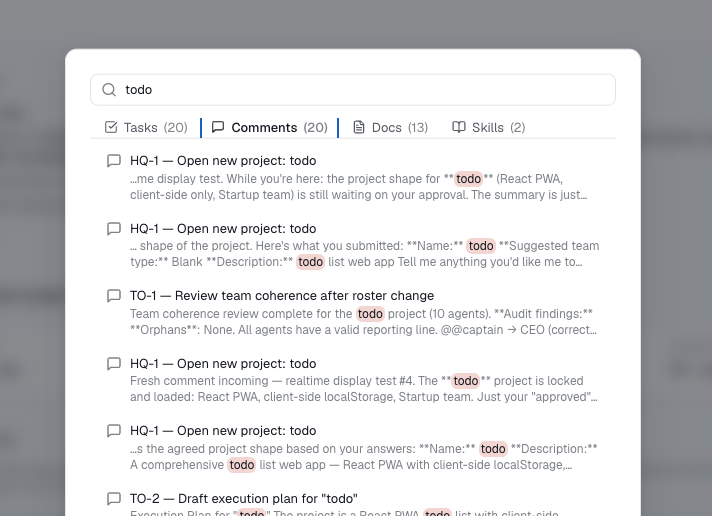

# Search

As a team's work piles up — tasks, long threads of comments, documents, the skills your
agents can run — you need one fast way back to any of it. Hezo has a **global search
palette**: open it from anywhere, type, and jump straight to the result.

Open it with the **search box in the top bar**, or the keyboard shortcut **⌘K**
(**Ctrl+K** on Windows and Linux), from any page.

## What it searches

One query covers four kinds of content, and the results are split into a tab per kind
with a count — so you can see at a glance where the matches are and switch between them:

- **Tasks** — by title and description.
- **Comments** — the discussion threaded on every task.
- **Docs** — your project [documents](/docs/concepts/documents-and-memory).
- **Skills** — the reusable skills your agents can run.

Pick a result to go straight to it: a task or comment opens that task (a comment match
scrolls to the exact comment), a doc opens the document, and a skill opens its settings.
The palette closes and you land where you needed to be.

## One search, every team

The palette searches **across all the teams you can access** at once — you don't pick a
project first, and [HQ](/docs/concepts/projects-and-teams#hq--the-home-team) is included
like any other team. Skills are instance-wide, so they turn up wherever you search.
Scoping is enforced on the server: content from a team you can't see never appears in
your results.

## Finds by meaning, not just keywords

Hezo ranks results by **meaning**, not only matching words — so a search for "auth bug"
can surface a task titled "login returns 401" even with no words in common. Where your
literal words do appear they're **highlighted** in the snippet; a result matched only by
meaning is tagged **related** so you know why it's there. Type at least two characters to
begin, and results refine as you type.

## Indexed on your own server

Search is powered by an embedding index that Hezo builds and queries **entirely on your
own server** — your tasks, comments, and documents are never handed to an outside search
service, in keeping with the rest of Hezo. The model loads in the background a moment
after the server starts (search will say it's loading until it's ready), and new or
edited content is indexed automatically just after you save it, so a brand-new task can
take a few seconds to become findable.
